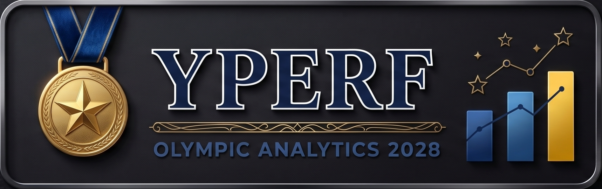

<p align="center">
  
</p>
# YPerf — Documentation du projet
## Anticipation des performances sportives · JO 2028 Los Angeles

---

## 1. Vue d'ensemble

**YPerf** est une application de data storytelling qui analyse les performances olympiques historiques et projette les résultats des Jeux Olympiques 2028 à Los Angeles. Elle couvre l'ensemble du pipeline : acquisition des données, analyse exploratoire, modélisation prédictive et visualisation interactive.

```
Kaggle / IOC
     │
     ▼
01_data_acquisition.py   ← Acquisition, nettoyage, feature engineering
     │
     ▼
data/processed/*.parquet
     │
     ├──► (Points 2 & 4 — EDA + Dashboard existants)
     │
     ▼
03_modeling.py           ← Régression, clustering, scoring athlètes
     │
     ▼
models/ + reports/
     │
     ▼
05_app.py (Streamlit)    ← Application déployée localement
```

---

## 2. Prérequis

- Python 3.10 ou supérieur
- pip (ou conda)
- Compte Kaggle configuré (pour le téléchargement automatique)

---

## 3. Installation

### 3.1 Cloner le dépôt

```bash
git clone https://github.com/votre-org/yperf-jo2028.git
cd yperf-jo2028
```

### 3.2 Créer un environnement virtuel

```bash
python -m venv .venv
source .venv/bin/activate          # Linux / macOS
.venv\Scripts\activate             # Windows
```

### 3.3 Installer les dépendances

```bash
pip install -r requirements.txt
```

### 3.4 Configurer l'API Kaggle

Crée un fichier `~/.kaggle/kaggle.json` avec tes identifiants :

```json
{"username": "ton_username", "key": "ta_clé_api"}
```

Ou copier le `.env.example` :

```bash
cp .env.example .env
# Éditer .env avec tes valeurs
```

---

## 4. Structure du projet

```
yperf-jo2028/
│
├── 01_data_acquisition.py   # Point 1 — Pipeline acquisition & nettoyage
├── 03_modeling.py           # Point 3 — Modélisation prédictive
├── 05_app.py                # Point 5 — Application Streamlit
│
├── data/
│   ├── raw/                 # Données brutes téléchargées (gitignorées)
│   └── processed/           # Fichiers Parquet produits
│       ├── olympics_clean.parquet
│       ├── country_year_stats.parquet
│       ├── sport_year_stats.parquet
│       ├── athlete_stats.parquet
│       ├── prediction_features.parquet
│       ├── predictions_2028.parquet
│       ├── country_clusters.parquet
│       └── athlete_scores.parquet
│
├── models/
│   ├── regression_medals.pkl     # Meilleur modèle de régression
│   └── clustering_countries.pkl  # Pipeline K-Means + scaler
│
├── reports/
│   ├── feature_importance.png
│   ├── kmeans_elbow.png
│   ├── cluster_scatter.png
│   └── model_report.json
│
├── requirements.txt
├── .env.example
├── .gitignore
└── README.md
```

---

## 5. Utilisation

### Étape 1 — Télécharger les données

```bash
# Dataset principal (1896–2016)
kaggle datasets download -d rgriffin/olympic-history -p data/raw/ --unzip

# Optionnel : Paris 2024
kaggle datasets download -d piterfm/paris-2024-olympic-summer-games -p data/raw/ --unzip
```

### Étape 2 — Lancer le pipeline d'acquisition

```bash
python 01_data_acquisition.py
```

Produit dans `data/processed/` :
- `olympics_clean.parquet` — données nettoyées
- `country_year_stats.parquet` — statistiques par pays/année
- `sport_year_stats.parquet` — statistiques par sport/année
- `athlete_stats.parquet` — palmarès athlètes
- `prediction_features.parquet` — features pour la modélisation

### Étape 3 — Lancer la modélisation

```bash
python 03_modeling.py
```

Produit :
- `models/regression_medals.pkl` — modèle prédictif des médailles
- `models/clustering_countries.pkl` — modèle de segmentation
- `data/processed/predictions_2028.parquet` — prédictions JO 2028
- `data/processed/country_clusters.parquet` — segments de pays
- `data/processed/athlete_scores.parquet` — scores et côtes athlètes
- `reports/model_report.json` — métriques de validation

### Étape 4 — Lancer l'application

```bash
streamlit run 05_app.py
```

L'application est accessible à : **http://localhost:8501**

---

## 6. Sources de données

| Source | Contenu | Lien |
|--------|---------|------|
| Kaggle — rgriffin | 120 ans de JO (1896–2016), athlètes, médailles | [Kaggle](https://www.kaggle.com/datasets/rgriffin/olympic-history) |
| Kaggle — piterfm | Paris 2024, résultats complets | [Kaggle](https://www.kaggle.com/datasets/piterfm/paris-2024-olympic-summer-games) |
| IOC Official | Records, résultats officiels | [olympics.com](https://olympics.com/fr/jeux-olympiques) |

---

## 7. Modèles prédictifs

### 7.1 Régression — Prédiction des médailles par pays

**Objectif** : estimer le nombre de médailles totales qu'un pays obtiendra en 2028.

**Variables d'entrée** :
- Moyennes mobiles sur 3 éditions (médailles, score, athlètes)
- Tendances (différences, taux de croissance)
- Rang mondial, série de médailles consécutives

**Modèles comparés** : Random Forest, Ridge Regression, Gradient Boosting

**Validation** : TimeSeriesSplit (5 folds) — respecte l'ordre chronologique des données

**Métrique principale** : R² et MAE

### 7.2 Clustering — Segmentation des nations

**Objectif** : identifier 5 profils de nations olympiques.

| Profil | Description |
|--------|-------------|
| Dominants historiques | USA, Chine, Russie… médaillent massivement et régulièrement |
| Puissances émergentes | Nations en forte progression (Kenya, Jamaica, GB récent…) |
| Pays spécialisés | Excellent dans 1-2 disciplines (Jamaica sprint, Kenya fond…) |
| Participants réguliers | Présence constante, peu de médailles |
| Nouveaux entrants | Participation récente, potentiel à surveiller |

### 7.3 Scoring athlètes

Score composite YPerf (0–100) :

```
Score = (Gold × 3 + Silver × 2 + Bronze × 1)
        × facteur_longévité
        × facteur_récence
        (normalisé sur 100)
```

**Côtes** : Outsider / Compétiteur / Favori / Médaillable / Légende

---

## 8. Déploiement Docker (optionnel)

### Dockerfile

```dockerfile
FROM python:3.11-slim
WORKDIR /app
COPY requirements.txt .
RUN pip install --no-cache-dir -r requirements.txt
COPY . .
EXPOSE 8501
CMD ["streamlit", "run", "05_app.py", "--server.port=8501", "--server.address=0.0.0.0"]
```

### Build et lancement

```bash
docker build -t yperf-app .
docker run -p 8501:8501 -v $(pwd)/data:/app/data yperf-app
```

---

## 9. Limitations connues

- Les données Kaggle s'arrêtent en 2016 (dataset principal) ; Tokyo 2020 et Paris 2024 nécessitent un second dataset.
- La modélisation exclut les nouvelles disciplines ajoutées aux JO 2028 (breakdance retiré, baseball/softball…).
- Les blessures, retraites et disqualifications ne sont pas modélisées.
- Le modèle ne prend pas en compte l'avantage du terrain (USA en 2028).

---

## 10. Pour aller plus loin

- Intégrer l'API World Athletics pour les records mondiaux en athlétisme
- Ajouter des données de championnats du monde récents comme proxies
- Modèles de séries temporelles (Prophet, LSTM) pour les sports à mesure continue
- Interface de paris/simulation Monte Carlo pour les côtes athlètes

---

## 11. Équipe & Licence

Projet fictif réalisé dans le cadre du brief **YPerf** · JO 2028 Los Angeles.

Données sources : Kaggle (CC BY 4.0) · IOC (droits réservés, usage éducatif)
